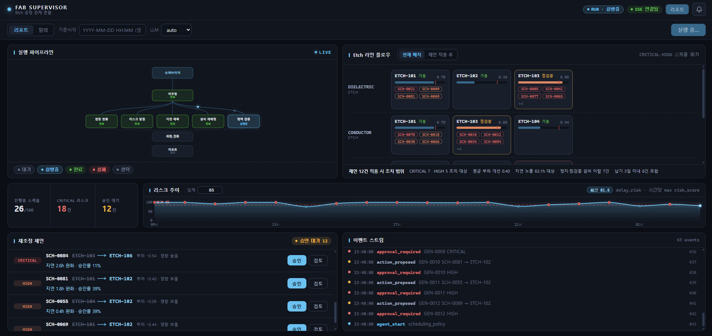
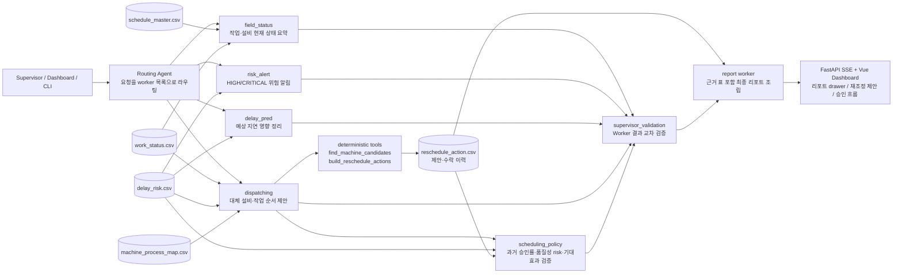
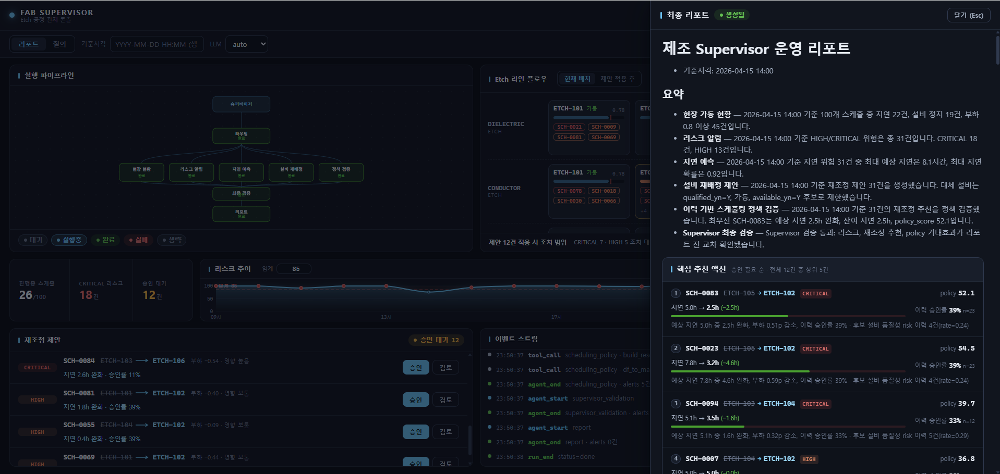
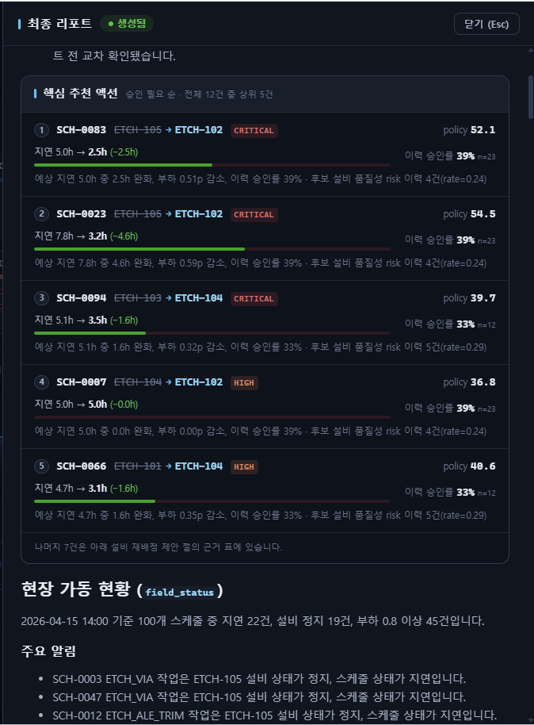
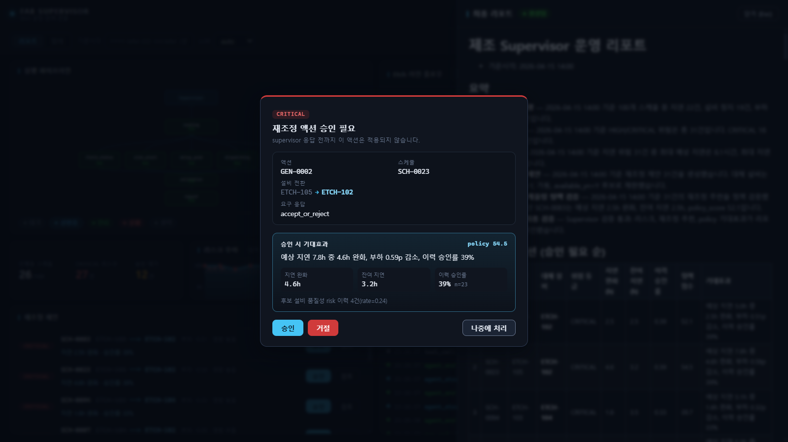
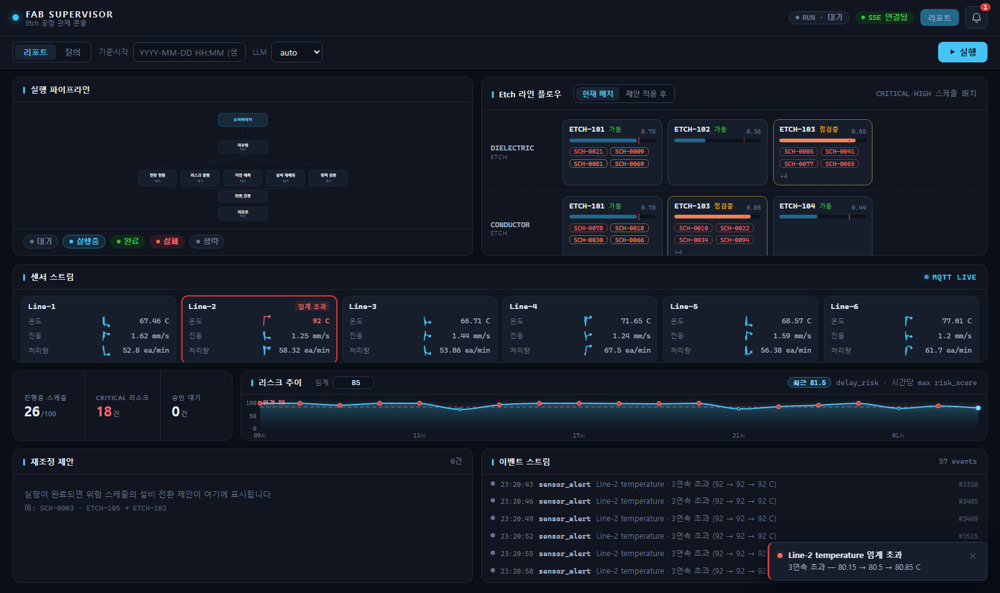

# 생산 Supervisor + Dynamic Dispatching Agent PoC



```
작성자 : 신유진
작성 목적 : 생산 Supervisor AI Service + 공정군 단위 Dynamic Dispatching/Rescheduling Agent PoC
상태 : PoC (SKALA 과정 중 개발, 상용 시스템 아님)
```

> 미국 제조공장 인턴 시절, 슈퍼바이저가 라인을 돌며 눈으로 확인하던
> "어느 공정이 멈췄고, 뭘 먼저 처리해야 하는가"를
> 이벤트 로그 기반 감지 로직 + 멀티에이전트 리포트로 자동화해본 프로젝트입니다.

## 시나리오

A사 300mm 반도체 팹의 **Etch(식각) 공정군**을 대상으로 합니다.
전공정 전체 Fab Scheduler가 아니라, 특정 공정군 안에서 `process_step`별 작업을 어떤 설비에 배정하고
위험 발생 시 어떤 대체 설비/작업 순서를 추천할지 다루는 PoC입니다.

- `schedule_master`: 현재 작업의 `process_step`, `assigned_machine`, 납기, 우선순위 관리
- `work_status`: 설비 상태, 부하율, 작업자, 산출량 관리
- `delay_risk`: 지연 위험 점수/등급/예상 지연 시간 관리
- `reschedule_action`: 대체 설비, 순서변경, 작업분할, 우선순위조정 액션 관리
- `machine_process_map`: `process_step`별 배정 가능한 설비와 recipe/qualification 관리

## 구조

**Supervisor AI Service**

- 공정군의 현재 작업/설비 상태 요약
- `delay_risk` 기반 HIGH/CRITICAL 위험 작업 알림
- 납기, 우선순위, 설비 부하를 근거 표로 제시

**Dynamic Dispatching / Rescheduling Agent**

- `machine_process_map`에서 같은 `process_step`을 처리할 수 있는 설비 후보 탐색
- 설비 상태와 부하율을 기준으로 대체 설비 추천
- 작업 순서 변경, 작업분할, 우선순위조정 액션 생성
- `applied_yn`으로 작업자 수락/거절 이력 추적

감지·점수 계산은 전부 코드(판다스)가 수행하고, LLM은 결과를 현장이 읽을 수 있는
리포트·알림 문구로 변환하는 역할만 맡습니다. 수치를 LLM이 만들어내지 않도록 분리했습니다.

### Agent 구조

현재 구현에는 `scheduling_policy` agent가 포함됩니다. 이 agent는 `dispatching`이 만든 후보를
`reschedule_action.csv`의 과거 승인/적용 이력, 기존 `efficiency_gain`, 후보 설비의 품질성 risk 이력,
현재 부하·setup time과 함께 검증해 `policy_score`와 기대효과를 산출합니다. 이후 Supervisor가
`risk_alert`·`delay_pred`·`dispatching`·`scheduling_policy` 결과를 한 번 더 교차 검증한 뒤
최종 리포트를 조립합니다.



## 대시보드 UI

현재 대시보드는 실행 파이프라인, Etch 라인 플로우, KPI, 리스크 추이, 재조정 제안 큐,
이벤트 스트림, 우측 리포트 드로어로 구성됩니다. 리포트 드로어는 `run_end.key_actions`가 있으면
핵심 추천 액션을 고정 컴포넌트로 보여주고, 승인 모달은 `scheduling_policy`가 계산한 기대 지연 완화,
잔여 지연, 이력 승인률, 품질 risk 이력을 함께 표시합니다.






## 결과물

- 리포트 예시 1: [report mode 실행 결과](reports/stage9_report_report_mode.md)
- 리포트 예시 2: [HIGH/CRITICAL 위험과 reschedule_action 추천 결과](reports/stage9_report_ask_dispatching.md)
- 대시보드 리포트 스크린샷: [dashboard-stage9-report-drawer.png](reports/dashboard-stage9-report-drawer.png)
- 대시보드 승인 모달 스크린샷: [dashboard-policy-approval-modal.png](reports/dashboard-policy-approval-modal.png)



두 리포트 예시는 `docs/api-spec.md`의 원본 CSV 컬럼명(`schedule_id`, `risk_score`,
`risk_level`, `original_machine`, `alternative_machine`, `efficiency_gain`)을 그대로 유지합니다.

## MQTT 센서 스트림 

> Mosquitto 기반 실시간 센서 스트림이 backend부터 대시보드까지 연결

- `src/sensors/simulator.py`: 6개 라인 × temperature/vibration/throughput 센서값을 MQTT topic으로 publish (별도 프로세스)
- `src/sensors/subscriber.py`: Mosquitto `factory/#` 구독 후 `sensor_update`, `sensor_alert` SSE 이벤트 발행
- `src/sensors/rules.py`: 60초 내 동일 라인·센서 3회 연속 임계 초과 시 alert를 내는 deterministic rule
- `MQTT_ENABLED=true`일 때 FastAPI startup에서 subscriber를 시작
- 대시보드 **센서 스트림 패널**: 라인별 최신값 + 최근 60초 스파크라인(vanilla canvas),
  `sensor_alert` 수신 시 해당 라인 카드 경고색 토글 + critical 토스트(라인·센서당 60초 스로틀).
- **센서 이상 → Supervisor 자동 트리거**: `sensor_alert`가 쿨다운(라인당 5분)을 통과하면
  `auto_run_triggered` 이벤트 발행 후 Supervisor가 고정 템플릿 질의로 자동 실행됩니다
  (`run_start mode:"auto"` — 타임라인에 "자동 실행" 배지로 구분 표시). 수동 실행 중 도착한
  트리거는 대기열 없이 폐기됩니다. E2E 증빙: [stage11-auto-trigger-events.log](reports/stage11-auto-trigger-events.log)



- 실시간 데모 영상: [mqtt실시간센서입력.mp4](reports/mqtt실시간센서입력.mp4)

실행 방법 (Mosquitto 서비스 기동 상태에서):

```bash
MQTT_ENABLED=true uvicorn src.server:app --port 8000
python -m src.sensors.simulator --anomaly temp-drift   # 별도 터미널
```

**확장 방향** — 현재 자동 트리거는 임계치 초과에 반응하는 룰 기반(코드 판정)입니다.
여기에 머신러닝 기반 이상 예측 모델을 얹어, 임계치를 넘기 전 **예상 이상이 감지되는 시점**에
Supervisor를 선제적으로 자동 트리거하는 방식으로 개선할 계획입니다
(배경 테이블 `delay_history`, `historical_ct` 등이 학습 데이터 후보입니다).

## 데이터 (`data/`)

전부 `data/generate_dataset.py`가 만든 **합성 데이터**이며, 기준시각 2026-04-15 14:00의
Etch 공정군 상황을 스냅샷으로 담고 있습니다 (명세: `data/README_dataset.txt`).
내장 이상상황(ETCH-105 정지, ETCH-103 점검중, CRITICAL 위험 등)이 시나리오로 심어져 있어
같은 데이터로 데모가 항상 재현됩니다.

**핵심 테이블 5종** — 에이전트와 조회 API(`/api/*`)가 사용합니다.

| 파일 | 행 | 내용 | 주 사용처 |
|---|---|---|---|
| schedule_master.csv | 100 | 생산 스케줄 허브 — 작업별 `process_step`, 배정 설비, 납기, 우선순위, 상태 | field_status · delay_pred · 납기 위험 판정 |
| work_status.csv | 100 | 설비·작업 현황 — 설비 상태, 부하율, 작업자, 불량/산출량 | field_status · dispatching |
| delay_risk.csv | 100 | 지연 위험 분석 — `risk_score`/등급, 지연 확률, 예상 지연시간, 감지 시각 | risk_alert · delay_pred · 리스크 추이 차트 |
| reschedule_action.csv | 53 | 재조정 액션 제안/이력 — 원설비→대체설비, `applied_yn` 승인 이력 | dispatching · scheduling_policy (이력 승인률·품질 risk 검증) |
| machine_process_map.csv | 12 | `process_step`별 배정 가능 설비 — qualification, 선호순위, setup time, 가용성 | dispatching 후보 탐색 |

**배경 테이블 9종** — SI 제안서 구조의 라인 운영 데이터로, 시나리오의 맥락을 구성합니다.
현재 에이전트 코드는 읽지 않으며, api-spec 스코프 가드에 따라 API로도 노출하지 않습니다
(이력 분석·예측 고도화 확장용).

| 파일 | 행 | 내용 |
|---|---|---|
| production_plan.csv | 6 | 일자·시프트별 PO 생산 목표 (수량, 납기, 고객 등급) |
| work_event_log.csv | 143 | 작업 시작/완료/이상 이벤트 로그 |
| real_time_production.csv | 246 | PO별 누적 생산량·진척률 스냅샷 |
| delay_history.csv | 240 | 과거 지연 사유·심각도·해결 시간 이력 |
| historical_ct.csv | 1,440 | SKU × 공정별 일자별 CT(사이클타임) 실적 |
| line_assignment.csv | 48 | PO의 라인·작업자·계획 시작/종료 배정 |
| line_master.csv | 15 | 라인/존 마스터 — 스테이션 수, 일 생산능력, 가동 상태 |
| process_master.csv | 48 | SKU별 공정 순서·표준 CT·버퍼·요구 스킬 |
| operator_master.csv | 7 | 작업자 스킬 레벨·담당 존·시프트·인증 공정 |

데이터 접근은 전부 `src/tools/loader.py`를 경유합니다 — 에이전트·툴이 CSV를 직접 열지 않으므로
저장소를 교체(CSV→SQLite)해도 loader 내부만 바꾸면 됩니다.

## 실행

```bash
python -m venv venv
.\venv\Scripts\activate
pip install -r requirements.txt
copy .env.example .env   # LLM_PROVIDER와 필요한 API key 설정
.\venv\Scripts\python.exe -m src.main --mode report --asof "2026-04-15 14:00"
uvicorn src.server:app --host 127.0.0.1 --port 8000
```

대시보드 개발 서버:

```bash
cd frontend
npm install
npm run dev
```

센서 스트림 데모:

```bash
# Mosquitto를 먼저 실행한 뒤
set MQTT_ENABLED=true
uvicorn src.server:app --host 127.0.0.1 --port 8000

# 별도 터미널
.\venv\Scripts\python.exe -m src.sensors.simulator --anomaly temp-drift
```

## 한계 (정직하게)

- 합성 데이터 기반 PoC이며 실공정 연동·상용 운영 검증은 하지 않았습니다
- 전공정 전체 Fab Scheduler가 아니라 Etch 공정군 단위 리스케줄링 PoC입니다
- 지연 위험 점수와 효율 개선율은 룰 기반 합성 값이며, 실제 운영 검증은 하지 않았습니다
- MQTT 브로커는 인증/TLS 없이 로컬 데모 한정으로 사용합니다
